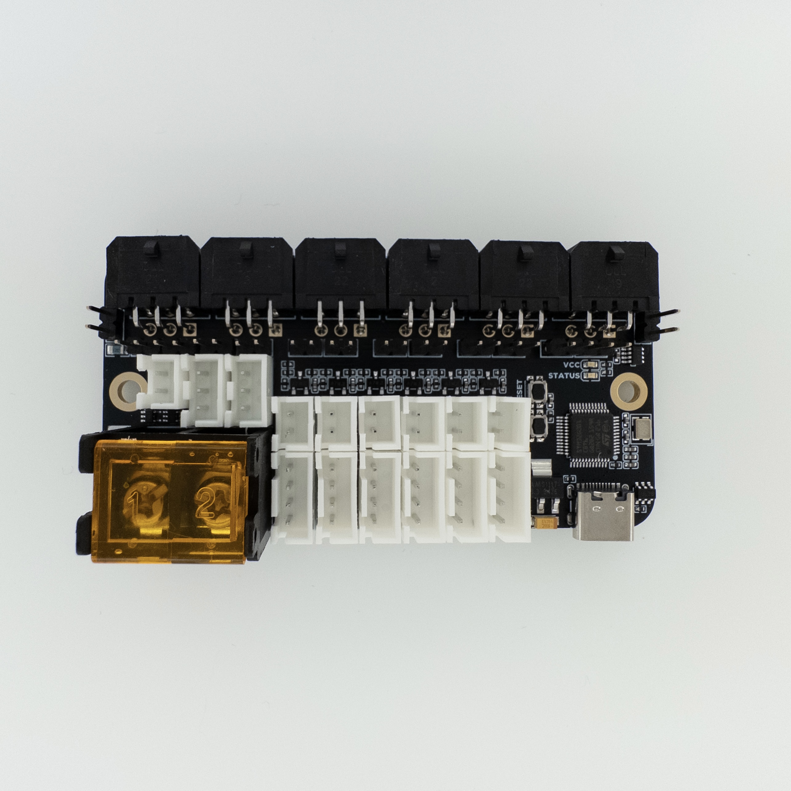

# Birds' Nest CAN Toolchanger CAN Hub

Birds' Nest is a CAN hub PCB designed for toolchanger printers with CAN toolhead PCBs. It features:
- 6x CAN Connectors for Up To 6 Toolheads
- Expansion Ports for More CAN Devices
- Follows ISO 11898 CAN Topology, Increasing Reliability
- 6x 4-pin Filament Sensor Connectors
- 6x Thermistor Connectors
- 2x 5V ARGB Connectors

## Purchasing a Birds' Nest CAN
### Buy From Me
- Each PCB tested by me
- All connectors needed are included (if applicable)
- Supports the development of open-source projects like this
- Ships worldwide

#### United States
- [Isik's Tech](https://store.isiks.tech/products/birds-nest-can)

### Resellers
- Each PCB tested by me
- All connectors needed are included (if applicable)
- Supports the development of open-source projects like this

#### TBD

You can also use the included gerber files to order your own from a PCB manufacturer like [PCBWay](https://www.pcbway.com/setinvite.aspx?inviteid=374841) or [JLCPCB](https://jlcpcb.com/). Make sure to order 2 oz inner layers.
 

## Instructions

[Birds' Nest CAN Manual](./Docs/Birds-Nest-CAN-Manual.pdf)

## YouTube

I am a YouTube content creator. If you want content about these projects & more, please consider [subscribing to my YouTube channel](https://www.youtube.com/channel/UClAWYmCkHjsbaX9Wz1df2mg).

## Notes
- Markdown files in this repository may contain Amazon Associate, Aliexpress affiliate, PCBWay affiliate, Jawstec affiliate, Polymaker affiliate links. I make a comission on qualifying purchases.
- This project does not come with any warranty, if you choose to build/use a PCB manufactured using published files in this repository, you are doing this at your own risk!
- If you want to sell PCBs manufactured using published files in this repository, you are allowed to, and you will not owe me any royalties. **You cannot claim that I endorse the sale**. You can check the license file for more information. However, if you **wish** to give me a share you can sponsor me on [GitHub](https://github.com/sponsors/xbst), subscribe on [Patreon](https://l.isiks.tech/patreon) or [YouTube](https://l.isiks.tech/member).
